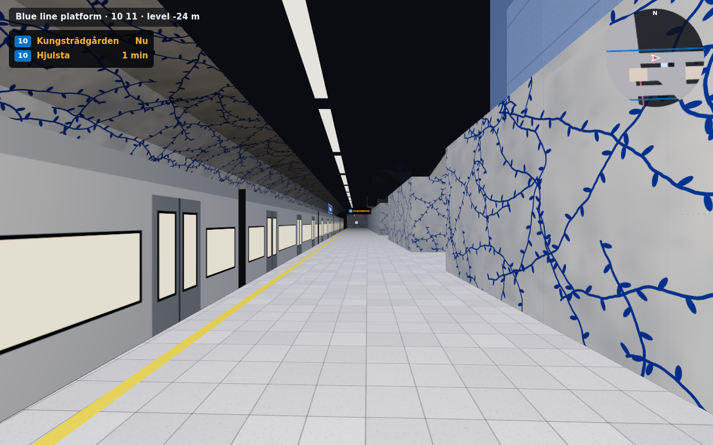
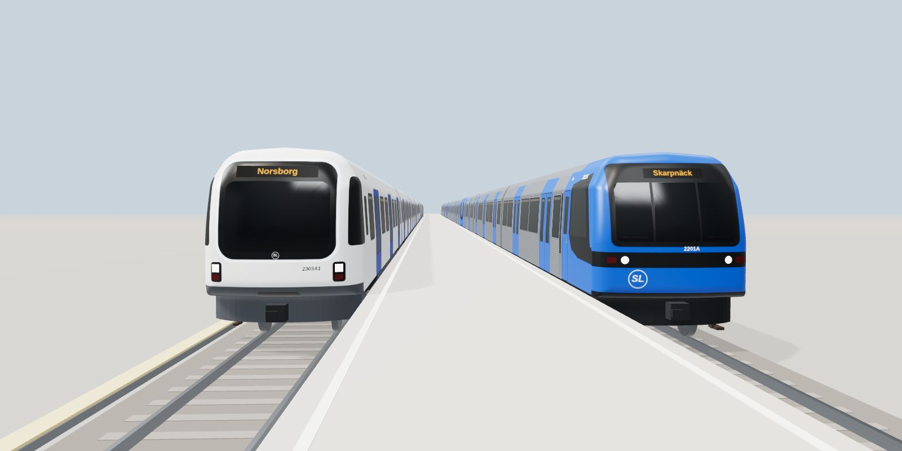
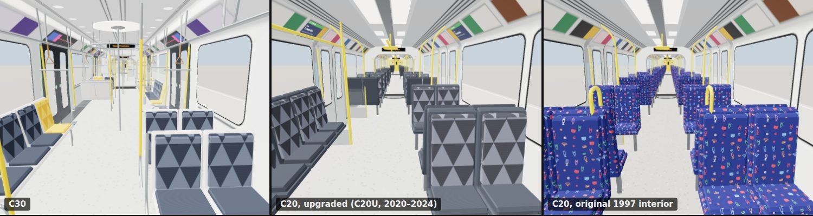

# T-Centralen Walk



A first-person walk through **T-Centralen / Stockholm City / Stockholm C**, running in the browser
with [three.js](https://threejs.org/). It is built on Albert Guillaumes' 3D drawing of the station
from [Stations and transfers](http://stations.albertguillaumes.cat/).

**Play it online:** https://elmaxe.github.io/tbana/

## Run it

It's written in TypeScript and built with [Vite](https://vite.dev/). You need Node.js 20 or newer:

```sh
npm install
npm run dev            # dev server with hot reload, e.g. http://localhost:5173
npm run build          # type-check, then build the static site into dist/
npm run typecheck      # type-check only
```

`npm run preview` serves the built `dist/`. The station model is in `public/assets/` and is copied
into the build unchanged.

### The inspector

```sh
npm run inspect               # opens http://localhost:5180/inspect.html in your browser
npm run inspect -- Slussen    # ... at a station; --no-open, --port 5180
```

A tool for checking the network by eye, which runs only on your machine. It starts the dev server
and opens a page in three panes:

- **Network:** a map of the whole track graph, each line in its colour, the red line's drawn
  track coloured by structure (rock, box, cutting, grade, embankment, bridge), and the places
  where `data/*-corrections.json` fixes the inputs. Click a station to stand on its platform,
  click the red line's track to stand over it looking along it, and shift-click to look down from above. The
  camera is shown on the map.
- **World:** the game's world at that place: T-Centralen, the network's track and stations, the
  city and the trains. Drag to look, `W A S D` to fly, `E`/`Q` up and down, `Shift` to go fast,
  the wheel for the speed. `T` drops to the track below, and a double-click says what you are
  looking at: its position, and the track and rail height there. **Open in game** opens the game
  at the same view.

  Beside it (or inset in its corner, or not at all) an outside camera follows from above and to
  the side, turning with it, and shows where it is and where it looks with a pink marker. Drag
  in it to swing it round, and the wheel brings it closer or further. While the first-person
  camera is indoors or underground, the outside view cuts away everything over its head, so you
  look down into the tunnel or station (**cut:** always or never instead).
- **Reference:** what the place was built from. For a station: Albert Guillaumes' 3D model of it
  where he has published one (T-Centralen, Odenplan, Fridhemsplan), to turn round and enlarge, and
  his drawing of it (all 105 of his Stockholm stations, on any line). Both are fetched from his site
  the first time they're shown and kept in `node_modules/.cache/inspect/`, never in the repository
  (delete that folder to fetch them again). Then the description,
  its frame (`build-stations --frame`), the heights from Wikidata and as built, the fixes made by
  hand with their reasons, OpenStreetMap's entrances, and the track plan and profile round it
  (`plot-graph`, `plot-profile`). For a track: its OpenStreetMap nodes and ways, its height,
  ground, gradient and structure where you clicked, and the services on it. With **follow
  camera** it shows the station you fly to.

After editing a description or a correction, **Rebuild…** runs the build tool and reloads at the
same view (the view is kept in the address). The game is served too, at `/`.

**Reporting problems.** Aim at something wrong (or double-click it) and press `R` (or
**⚑ Report**): write what's wrong, pick its kind, and `Ctrl`+`Enter` saves it. A report keeps a
screenshot of the views, the point and what's there (the nearest station, the track piece and its
rail height), links that open the inspector and the game at that view, and the commit it was seen
on (`+` if the checkout had changed). Reports are kept in the browser (IndexedDB) until cleared,
and show as flags on the map and pins in the world. The **Reports** tab lists them, takes you back
to each, and exports them:

- **Copy Markdown** or **Download .md**, to paste into an issue
- **Download .json**, with the screenshots; **Import .json** adds them in another browser
- **Save to repo** writes `inspect-reports/` in the checkout: `README.md`, `reports.json` and the
  screenshots, to commit or hand on

## Controls

| Key | Action |
| --- | --- |
| `W A S D` / arrows | Walk (`Shift` to run) |
| Mouse | Look (click the view to capture the mouse, `Esc` to pause) |
| `E` / `Q` | Ride a lift up / down (stand next to a light-blue shaft) |
| Walk through an open door | Board a metro train and ride it |
| `1`–`9` | Jump to a platform |
| `M` | Full map |
| `F` | Free flight (`Space` / `C` to rise and sink) |
| `R` | Back to the start |
| `N` | Sound on/off |

### Phones and tablets

Touch controls switch on automatically:

- **Left half:** drag to walk. Push the stick all the way to run.
- **Right half:** drag to look around. You can walk and look at the same time with two fingers.
- **Lift ▲ / Lift ▼** buttons appear when you stand next to a lift shaft.
- **⇡ / ⇣** appear in free flight.
- **Map** opens the full map, and so does tapping the minimap.
- Board a train by walking through an open door, as on a computer.
- **☰** opens the menu and the list of platforms to jump to.

On Android the game goes fullscreen in landscape when you start. On iPhone, turn the phone sideways
for the widest view. If the frame rate is low, the render resolution drops automatically.

### Riding the trains

Metro trains open their doors on the platform side a moment after they stop, and close them
after a chime before they leave. Walk in through an open door and you ride along: you can walk
through the car and, on the C30 and between the sections of a C20, into the next car. If you are
standing in a doorway when the doors close, you step inside or back onto the platform.

A chime sounds on the platform just before a train comes in, and inside the train just before it
comes into the next station. The C30 has its own door warning instead of the chime, and its doors
shut as the warning drops at the end. The recordings are in `public/sounds/`.

On the red and green lines the trains run the whole line on a timetable (see [Trains on the
network](#trains-on-the-network)), so you ride on from station to station through the real tunnels
and over the bridges. Step out at any station and wait there for the next train either way, or walk
up to the street (see [The stations](#the-stations)). At the end of the line the train waits at the
platform with its doors open and turns there: it leaves as the next train the other way, and you can
stay aboard.

On the blue line and the pendeltåg the model's tunnels are short, so the screen goes dark soon after
you leave, and you come back to T-Centralen in the same spot of a train on the other track. Seats
don't block you, and the pendeltåg can't be boarded.

## Deployment

`.github/workflows/pages.yml` publishes the site to GitHub Pages. It needs Pages to be switched on
once: **Settings → Pages → Build and deployment → Source: GitHub Actions**.

Every deploy rebuilds the whole site with `.github/scripts/assemble-site.sh`:

- `main` is at the root, https://elmaxe.github.io/tbana/.
- Every open pull request from this repository is at `pr/<number>/`, for example
  https://elmaxe.github.io/tbana/pr/3/. The workflow comments the link on the PR. Pushes to the PR
  redeploy it, and closing the PR takes it down. PRs from forks are not deployed, because their
  code would run on this site.
- The workflow always runs from `main`, and so do the build tools: a PR's files are compiled and
  bundled by `main`'s Vite and `vite.config.ts`, never run during the build. A PR that changes the
  build setup or adds packages is previewed with `main`'s setup until it is merged.

`.github/workflows/ci.yml` type-checks and builds every push and pull request.

The **Build** menu, on the start/pause screen and in the train viewer's panel, switches between
`main` and the PR builds and keeps you on the same page. It reads `builds.json` at the site root and
`build.json` in each build, which the workflow writes, so it doesn't show when you run the site
locally.

## What's generated

The source model is a diagram: extruded floor slabs, stairs, escalators and lift shafts, ticket
gates and tracks, identified by colour. `src/station.ts` reads it and adds:

- **Walkable surfaces**: floors, stairs and escalators, indexed in an XZ grid
  (`src/surface-index.ts`). Collision is simply "is there floor within a step of where you're
  going".
- **Walls, glass railings and platform edges**, generated along every slab outline. Each edge is
  probed to see whether it continues into another surface, overlooks a lower level, or faces a
  track. The blue line platform gets the blue vines on white rock that T-Centralen is known for.
- **Tracks**: each track ribbon's centre line is recovered and shifted to meet its platform edge,
  then given a track bed, rails, tunnels and a back wall.
- **Trains** (`src/trains.ts`) on the blue, red and green metro lines and the pendeltåg. They arrive,
  open their doors on the platform side, chime, close them and leave, and you can ride the metro
  trains. Departure boards and the HUD show the next trains. The red line runs C30 trains and the
  blue and green lines run C20s (see below). The pendeltåg are still plain boxes.
- **Lifts**: each shaft links the floors next to it.
- A **minimap** rendered once from above.

Destinations are picked from the direction of travel.

## World coordinates

The game is laid out on the real map, so that the rest of the network can be added around
T-Centralen (see [`docs/red-line-plan.md`](docs/red-line-plan.md)). World coordinates are metres on
SWEREF 99 18 00, the Stockholm zone of Sweden's national grid, around an origin at T-Centralen
(`src/geo.ts`):

- +x is east and +z is south (grid north is within 0.1° of true north here).
- y is the height above sea level in RH 2000. The station drawing is already drawn in those heights:
  the blue line platform is at −24 m, and the Stockholm C tracks are at +6 m.

`public/data/stations.json` says where each station model sits on that grid. The tools that make
it run on Node's built-in TypeScript support:

```sh
npm run fetch-osm -- t-centralen    # OpenStreetMap tracks and platforms -> data/osm/t-centralen.json
npm run fit-station -- t-centralen  # fit the model's tracks onto them -> public/data/stations.json
```

`fit-station` turns and moves the model in plan until its tracks lie on the OpenStreetMap tracks,
matching each line only to the same line. It prints how far apart they are: for T-Centralen the
median along the platforms is 0.8 m, and 90% are within 2 m. The tunnel ends of the drawing are
sketched, so they can be 20–40 m off.

### The track graph

`public/data/track-graph.json` holds the whole metro's track network from OpenStreetMap, with the
red and green lines' services traced through it. The format is in `src/track-graph.ts`. The game
reads its stations and services to draw the track and join T-Centralen to it (see [The track and
tunnels](#the-track-and-tunnels)).

```sh
npm run fetch-osm -- network      # every metro track, switch, platform and station -> data/osm/network.json
npm run build-track-graph         # -> public/data/track-graph.json
npm run plot-graph -- Slussen 400 slussen.svg   # draw part of it, to check by eye
```

`build-track-graph` does the following:

- It cuts the tracks into pieces at switches, ends and tunnel mouths.
- It works out which pairs of tracks each switch connects.
- It matches the platforms to the tracks beside them. A platform beside less than 50 m of track
  is another's (the pendeltåg's under Odenplan) and is left out; where platforms overlap along a
  track, the train stands at the middle of them together.
- Where OpenStreetMap glues two lines' tracks together with shared nodes, as the red and green
  lines' at T-Centralen, where they run one over the other, each line gets its own node. Yard
  track wired only overhead is a tram depot's (the Nockebybanan's at Alvik), not the metro's.
- It traces T13, T14, T17, T18 and T19 in both directions (`data/routes.json`), stopping at every
  platform, never reversing, and keeping to the left-hand track. These are the running lines
  (`ways`), which the tools fit and draw.
- It traces them again so that the trains can turn where they stand at each end: a train arrives
  on the platform track the train the other way leaves from. Either the arriving train crosses
  over before the platform, or the leaving one crosses over after it, or both use a track between
  the running lines (Åkeshov), whichever costs least at that end. Two services that turn at the
  same station stand on different tracks there (T18 and T19 at Hässelby strand). These are the
  routes the trains run.
- It copies the depots' views (for the game's list of places) from `data/routes.json`.
- It copies their timetable from `data/routes.json` into the graph: how often each service runs,
  and when its trains are at T-Centralen.

The build fails if a service can't be traced. `DEBUG=1` lists stations with only one platform
track, and stretches where a service runs on the right-hand track.

OpenStreetMap is sketchy in the tunnels, so a few fixes are kept in `data/track-corrections.json`,
each with its reason:

- missing crossovers at Mörby centrum and Skarpnäck
- the missing platforms at Norsborg, Gubbängen and Skarpnäck
- island platforms drawn on the wrong side of a track, or across it, at Danderyds sjukhus,
  Aspudden, Medborgarplatsen, Skanstull, Svedmyra and Sankt Eriksplan
- platforms drawn short of their 145 m at Bagarmossen, Bandhagen, Blackeberg, Rågsved and Stureby

[Gleisplanweb's track plan](https://www.gleisplanweb.eu/) was the reference for these. It is
only a reference, because its licence doesn't allow reuse.

### Track heights

`public/data/track-heights.json` gives the height of the top of the rail (RH 2000) along every piece
of the red and green lines' track: what their services run on, and the crossovers, sidings, turnback
tracks and depots joined to that, and the tracks joining the two lines, as far as the blue line's
track (`lineTrack` in `tools/lib/graph.ts`). Track no service runs on is left out where it passes a
platform (the middle tracks at Alby and Sätra, Liljeholmen's third track), because the stations are
described without it.

```sh
npm run fetch-station-heights    # Wikidata station heights -> data/station-heights.json
LM_USER=… LM_PASSWORD=… npm run fetch-ground -- tracks green   # ground under the tracks -> data/ground/green-line.json
npm run build-heights            # -> public/data/track-heights.json, and the check
npm run plot-profile -- "T13 Norsborg" t13.svg  # side view of a service
```

`build-heights` fits the smoothest line through these anchors:

- **Stations:** 1 m below their height from Wikidata, which is taken to be the platform's level,
  and level along the platform. Wikidata has none of the green line's: for its underground
  stations `data/height-corrections.json` gives the height or the depth under the ground from
  Swedish Wikipedia (Fridhemsplan 1.3 m, Odenplan 9 m deep, Skarpnäck 25 m deep…). A station with
  no height still has its platform tracks level with each other.
- **T-Centralen:** its platforms in the station model.
- **Surface track:** the ground from Lantmäteriet's 1 m elevation model.

It keeps tunnels at least 6 m under the ground away from their mouths (3 m for the track no
service runs on, which may be in concrete boxes), and the gradient at 37‰ or less, the way a real
line runs at an even grade between short vertical curves, and the vertical curves of the services'
track no tighter than their line's limit. It fits the running lines first, then
the rest of the track with the running lines pinned, so the depots don't move the line. Where two
tracks cross one over the other (OpenStreetMap's layers differ), they are held 6.5 m apart. A
depot's track through its halls, or inside any building, gets no ground anchor: the elevation
model there follows the roof. It then checks the
result against the 1975 limits: 40‰, 10‰ along platforms, and vertical curves of at least 2,000 m
on the red line and 1,500 m on the green. It fails on anything outside them, and says where.

`data/height-corrections.json` fixes the inputs where they are wrong, each with its reason:

- Gamla stan's Wikidata height is the street; its platforms are on a deck about 5 m higher.
- In Riddarholmskanalen the line runs in a trough, not a bored tunnel, so it needs no cover.
- South of Gamla stan's platforms, OSM's surface track is still on the station deck.
- At Sätra, OSM draws a siding a few metres into the bank beside the running lines.
- The green line's station heights and depths, above.
- Under the green line at Kristineberg, Alvik and Farsta the elevation model dips 5 m where a road
  passes under the track, and at Svedmyra the platform stands on a bank over the street.
- At Gullmarsplan the tracks south of the platforms are in a box under the bus terminal's deck.

`fetch-ground` needs a free Geotorget account at Lantmäteriet, given as `LM_USER` and
`LM_PASSWORD`. It finds the files through Lantmäteriet's STAC catalogue for height data. Behind a
proxy that adds the login, run it with `NODE_USE_ENV_PROXY=1` so that Node's `fetch` uses the proxy.
Each line has its file, `data/ground/<line>-line.json`, which takes the drawn track the other
lines' files don't have. They are in the repository, so `build-heights` runs without a login.

### The track and tunnels

The game draws the red and green lines' track beyond T-Centralen, with its tunnels, bridges and
banks, from `public/data/track-geometry.json` (format in `src/track-geometry.ts`):

```sh
npm run build-track-geometry   # -> public/data/track-geometry.json, and the check
npm run plot-graph -- Östermalmstorg 700 otorg.svg   # draws it too, coloured by structure
```

`build-track-geometry` does two things.

**The plan.** OpenStreetMap is traced from aerial photos in the open, but in the tunnels it is
sketched, and the two tracks of a line wander 4 to 35 m apart. The tool fits the smoothest line
through:

- OpenStreetMap's track: closely in the open and at the platforms, loosely in the tunnels
- T-Centralen's platform tracks in the station model
- the two tracks of a line in a tunnel at the same level: 3.15 m apart, as built (the 1975
  standard), or a platform's width apart at an island platform
- tracks at different levels: at least 7.5 m apart, so that their tunnels don't cut into each other

It keeps curves at the line's limit or wider: 250 m on the red line and 200 m on the green (the
1975 description), and fails if it can't. In the open the green line keeps OpenStreetMap's curves,
traced from aerial photos, even where they are tighter than that: it turns at 115–150 m between
Alvik and Stora mossen. Where OSM's track at T-Centralen's two levels winds out of the station it
is smoothed only roughly, and the check leaves it out. Track no
service runs on is fitted afterwards, closely to OpenStreetMap even in the tunnels (the depots and
sidings are mapped from plans), with the running lines pinned. For every point it also notes the
nearest track on each side.

**The structure.** Each point is in a rock tunnel, a concrete box (cut and cover, near the
mouths, and wherever the rock over the tunnel would be less than 12 m), a cutting, on the
ground, on an embankment, or on a bridge. The two tracks of a line share a tunnel, bridge or bank
where they run side by side.

The game sweeps cross-sections along this line (`src/network.ts`): ballast and sleepers, rails, the
conductor rail with its cover board, and the tunnel or bank around them. The sizes come from the
typical sections in the 1952 and 1975 technical descriptions (`src/sections.ts`): an 8.0 m wide
double-track rock tunnel 4.6 m high, a 4.3 m single-track one, and a box 4.2 m high. At the
stations it draws the platform hall, the platform and its name signs, and the stations' own
passages and stairs open out of it (see [The stations](#the-stations)).

The crossovers, sidings and depots are drawn too:

- In a depot in rock (Norsborg), the tracks share a flat-roofed hall 6 m high, with a row of
  lamps over each track. In the open, the formations of tracks side by side meet halfway.
- Where a siding or crossover comes within 4.5 m of a running line in a tunnel, the running line's
  tunnel widens to take it in. Where the siding's own tunnel begins, each tunnel is cut out of
  the other's walls, so the one opens into the other.
- There is no conductor rail where another track comes closer than the standard spacing (at
  turnouts). Tracks that end have a buffer stop, and in a tunnel a wall.

The network is cut into 200 m tiles, and only the tiles within about 600 m of the camera are built.
`src/station-join.ts` joins T-Centralen's red and green tracks to the network: the station draws
its platforms, and beyond them the trains run on the network's track. A route stops where its line
passes the middle of the model's platform.

To fly the tunnel, jump to a red line platform (`2` or `3`), press `F`, and follow the track
north to Östermalmstorg or south to Gamla stan. The menu's list of the lines' stations also has the
depots (Norsborgsdepån and Nybodadepån on the red line, Vällingbydepån, Hammarbydepån and
Högdalsdepån on the green), which it flies to; so does `?at=Nybodadepån`.

### Trains on the network

The red and green lines' trains run on the timetable in the track graph (`src/timetable.ts`). T13
and T14 each run every 5 minutes each way, alternating on the shared trunk, so from Liljeholmen to
Östermalmstorg there is a train every 2.5 minutes. T17 (Åkeshov–Skarpnäck), T18 (Hässelby
strand–Farsta strand) and T19 (Hässelby strand–Hagsätra) each run every 10 minutes, taking turns
from Alvik to Gullmarsplan, a train every 200 s. T18 runs to Hässelby strand as in the rush hours:
off-peak it turns at Alvik, on a platform the through trains use, which the timetable can't do yet.
The red line runs C30 trains and the green line C20s. To change the service, edit `timetable` in
`data/routes.json` and run `npm run build-track-graph`.

Each trip runs its route from end to end:

- It stands at the first station with its doors open until it is due out.
- It stops at every station for at least 22 s, opening its doors on the platform side.
- At the last station it turns where it stands: it becomes the next trip the other way, and waits
  with its doors open until that one is due out. Once the game is going, every train leaving the
  end of the line is one that came in; when the game starts, the trips under way are placed where
  the timetable has them, and the trains that came in before it started stand at the ends as the
  next trips.

The trips keep at least 30 m apart where they share track. At a junction, the one that would get
there first goes first. A train waiting to leave the end of the line has the track out of the
station, out to where it leaves the incoming trains' way, so the next train in waits clear of it.
Simulated for three hours, 63 trains run round, every green line trip on time. The red line's
trains turn at the ends in 65 s (Fruängen) to 236 s (Norsborg), the green line's in 4 to 8 minutes.
A train held 4 minutes at Slussen makes those behind it late, and the lateness dies out at the
ends.

About 50 trains stand out of service on the depots' stabling tracks and on the sidings that end at a
buffer stop, showing "Ej i trafik".

Only the trips within about 700 m of the player get a train model, from a pool.

The network's platforms can be walked on, and the HUD shows the next trains from them and from the
station halls.

### The stations

Every red and green line station beyond T-Centralen can be walked from its platform up (or down)
to the street: through passages, stairs, escalators and ticket halls, to exits at OpenStreetMap's
subway entrances. Out on the green line's branches, OSM's entrance often lies between the tracks
just past the platform, where the passage under the bank comes out; there isn't the headroom for
an exit under the track, so the passage leads on under it to an exit beside the line. Each station is built from a short description in `data/station-descriptions.json`,
read from Albert Guillaumes' drawing of it:

```sh
LM_USER=… LM_PASSWORD=… npm run fetch-ground -- entrances   # streets round the stations -> data/ground/entrances.json
npm run build-stations                    # -> public/data/station-layouts.json, and the checks
npm run build-stations -- --frame Slussen # a station's frame, for writing its description
```

A description lists the ways out, each as a route of steps from a point on the platform:

```json
{ "from": [70, 0], "width": 6, "go": [
  { "walk": [92, 0] },
  { "escalators": 15, "toward": [147.6, -42.9], "lanes": "EES" },
  { "walk": 8, "width": 8 }, { "gates": true }, { "walk": 4 },
  { "exit": 247203403 }
] }
```

- Points are `[s, u]` in the station's frame: metres along the platforms from their middle, and
  across them to the right. Heights are metres above the platform. `--frame` prints where the
  tracks and platforms are in it, the street above, and the entrances nearby.
- `walk` goes to a point, or on for so many metres; with `dh` it is a ramp, and `open` leaves it
  without a ceiling.
- `stairs` and `escalators` climb a height (down if negative) towards a point, or end at it with
  `to`. `lanes` lists them from the left looking up: `E` an escalator, `S` stairs.
- `lift` rises a height; `gates` puts ticket gates across the way; `mark` names a place that
  another route can start `from`.
- `exit` comes up to the street at an OSM entrance, by its id or name, or at `{ "at": [s, u] }`,
  by stairs, escalators, a ramp (`walk`, with a `ceiling` where it passes low under a track) or a
  lift.

The platforms themselves come from the track geometry, so a description gives only the ways out.
`build-stations` resolves the routes into floors, flights, lifts and gates in world coordinates,
and fails, saying where, on:

- a ramp steeper than 8%, or stairs with no room before their point
- anything in the trains' way: 1.5 m either side of a track, up to 4 m above the rails (it says
  where, in the station's frame too)
- a platform from which the street can't be walked to, or an exit that leads to no platform,
  walked on a 0.5 m grid with steps of up to 0.6 m

The game builds them in `src/stations.ts`. Walls aren't described: they stand wherever a floor
ends without another floor beyond it, as in the T-Centralen model. Each part's open space is cut
out of whatever it runs into (`src/clip.ts`): a passage opens through the platform hall's wall, an
escalator climbs through its vault, stairs go down through a platform or up through the street.
The network cuts the same spaces out of its tunnels and platforms.

To visit one, pick it from the red and green lines' stations in the menu, or start there with
`?at=Mariatorget`.

### The city

Everything within 1 km of the red and green lines has its ground and buildings, so the city is there
wherever you look out from a train, a bridge or a station's exit:

```sh
LM_USER=… LM_PASSWORD=… npm run fetch-terrain  # the ground, every 5 m -> data/ground/city.json, city.bin.gz
npm run fetch-city                             # OSM's buildings -> data/osm/buildings.json
npm run build-city                             # -> public/data/city/
```

- `fetch-terrain` reads Lantmäteriet's elevation model at 2 m (the overviews in its 10 km files)
  and samples it every 5 m on the game's grid, over the 500 m tiles that come within 1 km of the
  track: 766 tiles.
- `fetch-city` reads OpenStreetMap's extract of Stockholm county (from openstreetmap.fr, about
  80 MB, downloaded once a day to the temporary directory) and keeps the buildings and building
  parts in those tiles, with their courtyards: about 69,000.
- `build-city` shapes the ground round the track and writes one gzipped binary file per tile
  (format in `src/city-tile.ts`), 10.9 MB in all. The format is in tagged sections, so roof shapes,
  streets and water can be added later as new sections without breaking the game.

How the ground meets the track:

- Under open track the ground is lowered below the formation and rises from it at the bank's
  slope, so the track runs in a shallow cutting wherever the ground is higher; where the ground is
  lower, the track's bank runs on down into it.
- Over a tunnel the ground stays at least 0.5 m above the crown. A "tunnel" whose ground the
  elevation model has below half its height is a short covered way or one under a bridge the
  model leaves out, and stands in the open instead.
- At each tunnel mouth the tunnel's own space is cut out of the ground, and a headwall stands
  round the opening.

The buildings are blocks with flat roofs:

- They stand from below the lowest ground under them to their height above it: OSM's `height`,
  or its levels at 3.1 m, or for the 60% with neither, the median levels of the tagged buildings
  of the same sort within 150 m, or a default for the sort (a house 1.7 storeys, a shed 1).
- A building with parts is drawn as its parts. Roof shapes are kept for later; for now a pitched
  roof is a flat one halfway up it.
- Where a building stands over open track, the part over the track's space is lifted 5 m above
  the rails (or left out). Roofs on posts over the track are left out: the stations draw theirs.
- Where a station's stairs, lift or hall comes up inside a building, it is cut out of the
  building, and so is a way from the exit on through the building to the outside.
- A building the depot's covered track runs through (OSM's `covered=yes`) is a hall: it stands
  on the ground, open inside, with a door wherever a track passes through its walls. Nyboda has
  12, and the green line's depots at Vällingby, Hammarby and Högdalen 12 more.

The game (`src/city.ts`) builds the tiles within 1.1 km of the camera (800 m on phones), one a
frame, nearest first: about 400,000 triangles, a tile in 10 ms (median). Beyond 600 m the ground has
every other point. The ground is paved where buildings are close together and grass where they
aren't. It can be walked on, except beside open track a service runs on, inside buildings and over
the stations' openings (so the depot yards and halls can be walked through, but a hall's walls only
at its doors), and the street around the exits stays walkable as before but isn't drawn. A flood
fill from each of the 155 exits, with the player's step rule, in the game, reaches the city's ground
from all but one: Sätra's comes up into a street hemmed in by the shopping centre, the track and
higher ground.

`?nocity` starts the game without it.

## Train models



`trains.html` is a viewer for procedural 3D models of the metro's two current train types, the
**C20** (1997–2004, corrugated stainless steel) and the **C30** (MOVIA, in service since 2020).

- It shows one unit or a full 140 m train.
- It has front, side, bogie and inside views. WASD walks the camera through the cars.
- **Doors** opens and closes the sliding doors.
- A cutaway takes the roof off to show the seat layout.
- It can download the model as `.glb`.

Open it at https://elmaxe.github.io/tbana/trains.html, or locally at `/trains.html`.



The models include the passenger interiors: seats, poles and rails, lighting, screens, doors,
cab bulkheads and the open gangways, and you can see them through the windows. The C20 comes
with its current interior from the 2020–2024 upgrade, or the original 1997 one with Lasse
Åberg's moquette (`interiorStyle: 'original'`). In the station, interiors are drawn only for cars
near the player.

The models are built in code (`src/rolling-stock/`) from real dimensions, door and seat layouts,
liveries and fabrics. Research notes and sources are in
[`docs/rolling-stock.md`](docs/rolling-stock.md).

```ts
import { createTrain } from './src/rolling-stock';
const train = createTrain('C30', { destination: 'Norsborg' }); // two units, 140 m
scene.add(train.group);
train.setInterior(false); // exterior only; cars also have car.setInterior(on)
train.setDoors(1, 0);     // open the doors (0–1) on both sides; 1 / -1 for one side only
const c20 = createTrain('C20', { interiorStyle: 'original' }); // the 1997 interior
```

## Credits

Station geometry: 3D drawing of T-Centralen / Stockholm City / Stockholm C © Albert Guillaumes,
[stations.albertguillaumes.cat](http://stations.albertguillaumes.cat/), converted unchanged from the
site's `t-centralen.gltf` to `assets/t-centralen.glb`. The drawing is his work. Ask him before you
publish or redistribute this project.

Map data: © [OpenStreetMap](https://www.openstreetmap.org/copyright) contributors, under the Open
Database License (`data/osm/`, and the placements, track graph and track geometry derived from it
in `public/data/`).

Heights: Markhöjdmodell © Lantmäteriet, CC BY 4.0 (`data/ground/`, and the track heights and
geometry, the stations' streets and the city's ground derived from it in `public/data/`).

Buildings: © OpenStreetMap contributors, ODbL (`data/osm/buildings.json`, from the
openstreetmap.fr extract of Stockholm county, and the city's buildings in `public/data/city/`).

Station layouts: the red and green lines' stations are built from descriptions read off Albert
Guillaumes' drawings of them ([estacions.albertguillaumes.cat](http://estacions.albertguillaumes.cat/)),
used as a reference only; none of the drawings is copied into the project.
